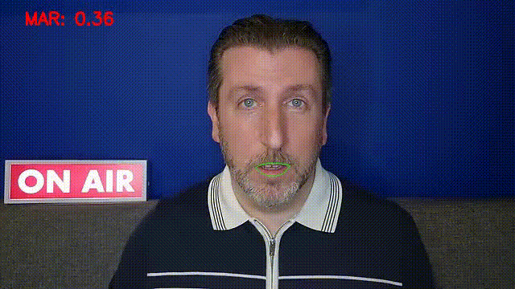

# Mouth Open Close Annotation on Video

## Overview
Designed a basic video annotation application that detects if the mouth is open or close and annotates on the video if it's open. The project is implemented in Python using OpenCV and Dlib library. 

## Features
- Upload video files through a web interface.
- Process videos to detect if mouth is open.
- Annotate the video with the mouth open/close status and highlight the mouth region.
- Download the annotated video.

## Pre-requisites
- Python 3.6 or higher
- pip

## Installation
### Step 1: Clone the repository
```bash
git clone https://github.com/ruchir-k/Video-Mouth-annotator.git
cd Video-Mouth-annotator
```

### Step 2: Create a Virtual Environment

Create a virtual environment named .venv within the project directory:
```
python3 -m venv .venv
```

#### Step 3: Activate the Virtual Environment

Activate the virtual environment by running the following command:
```
source .venv/bin/activate
```

### Step 4: Install Required Packages

Install the required Python packages using pip:
```
pip install -r requirements.txt
```

### Step 5: Run the Application
```commandline
cd deploy-vd-project
python app.py
```

### Deactivate the Virtual Environment

To deactivate the virtual environment, run the following command:
```
deactivate
```

## Sample output

Click on the image below to view the sample video:

